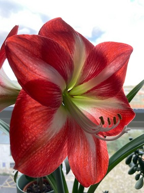

# style-transfer

Porting the style of one image onto another using neural networks, gardient descent and some cleverly chosen loss functions. The code is largely taken from [this blogpost](https://keras.io/examples/generative/neural_style_transfer/).

    

After a while, the red colour dominates and overwhelms any texture of the style image. I added an additional loss function to penalise colour change from the reference image, resulting in the following output:

